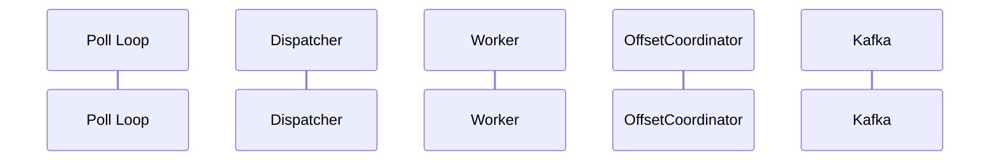

# Scenario: [Name]

> **Requirements:** [FR-x.x, NFR-x.x]

## Trigger

What initiates this scenario.

## Preconditions

System state before the scenario begins.

## Execution Sequence

1. **Poll loop**: ...
2. **Dispatcher**: ...
3. **Worker**: ...
4. **OffsetCoordinator**: ...

## State Changes

- **OffsetCoordinator**: [before] → [after]
- **Partitions**: [paused/resumed]
- **Dispatcher queue**: [change]

## Outcome

Expected system state after the scenario completes.

## Sequence Diagram

