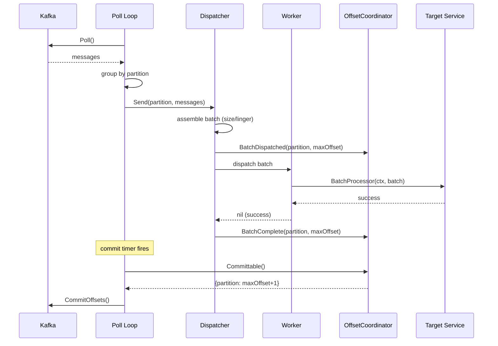

# Scenario: Happy Path

> **Requirements:** FR-1.1, FR-1.2, FR-1.3, FR-2.2, FR-2.3, FR-2.8, FR-2.9, FR-3.2, FR-3.3, FR-5.1, FR-5.2, FR-6.1

## Trigger

Kafka producer publishes messages to a topic the consumer is subscribed to.

## Preconditions

- Poll loop is running and the Kafka consumer is connected to the broker.
- Partitions are assigned and in resumed (active) state.
- Dispatcher has available capacity (queue not full).
- Target service is healthy.
- No in-flight batch for the partition being polled.

## Execution Sequence

1. **Poll loop**: Calls `Poll()`, receives messages from Kafka.
2. **Poll loop**: Groups messages by partition.
3. **Poll loop**: Calls `Dispatcher.Send(partition, messages)` for each partition group.
4. **Dispatcher**: Buffers messages internally, assembles a batch (by size threshold and/or linger time).
5. **Dispatcher**: Dispatches the batch to an available worker.
6. **Dispatcher**: Calls `OffsetCoordinator.BatchDispatched(partition, maxOffset)`.
7. **Worker**: Executes `BatchProcessor(ctx, batch)` — writes to the target service.
8. **Worker**: Returns `nil` (success) to the Dispatcher.
9. **Dispatcher**: Calls `OffsetCoordinator.BatchComplete(partition, maxOffset)`.
10. **Poll loop**: On next commit timer tick, calls `OffsetCoordinator.Committable()`.
11. **OffsetCoordinator**: Returns `map[partition] = maxOffset + 1` for completed partitions.
12. **Poll loop**: Calls `CommitOffsets()` to Kafka with the returned offsets.

## State Changes

- **OffsetCoordinator**: `empty` → `dispatched(partition, maxOffset)` → `completed(partition)` → `committed (cleared on Committable())`
- **Partitions**: Remain resumed throughout.
- **Dispatcher queue**: Increases on step 4, decreases on step 8.

## Outcome

- Messages are processed exactly once (in the absence of crashes).
- Offsets are committed to Kafka, advancing the consumer group position.
- The partition is ready to accept the next batch.

## Sequence Diagram

