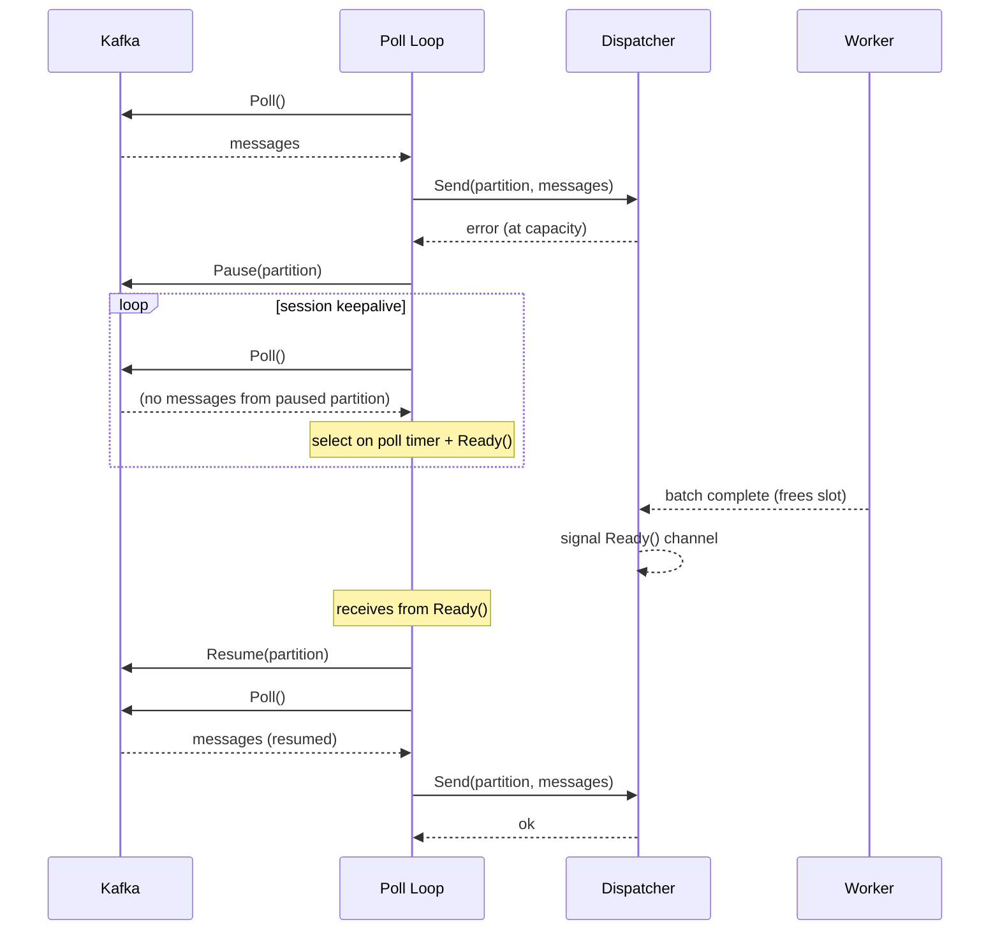

# Scenario: Backpressure (Pause/Resume)

> **Requirements:** FR-1.5, FR-1.6, FR-2.5, FR-2.6, NFR-1.1, NFR-1.2, NFR-1.3

## Trigger

The Dispatcher's internal bounded channel reaches capacity because workers are processing slower than the poll loop is fetching.

## Preconditions

- Poll loop is running and fetching messages.
- Dispatcher queue is approaching or at capacity.
- Workers are busy processing batches.

## Execution Sequence

1. **Poll loop**: Calls `Poll()`, receives messages from Kafka.
2. **Poll loop**: Calls `Dispatcher.Send(partition, messages)`.
3. **Dispatcher**: Returns an error indicating it is at capacity (backpressure signal).
4. **Poll loop**: Calls `Pause(partition)` on the Kafka consumer for the affected partition(s).
5. **Poll loop**: Continues calling `Poll()` at regular intervals in its main loop. Paused partitions return no messages, but the call maintains the consumer group session (heartbeats). The poll loop `select`s on both the poll timer and the `Dispatcher.Ready()` channel.
6. **Worker**: Completes a batch, freeing a slot in the Dispatcher queue.
7. **Dispatcher**: Signals the `Ready()` channel — capacity is available.
8. **Poll loop**: Receives from the `Ready()` channel.
9. **Poll loop**: Calls `Resume(partition)` on the Kafka consumer for the previously paused partition(s).
10. **Poll loop**: Next `Poll()` returns messages from the resumed partition. Normal flow continues.

## State Changes

- **Partitions**: Resumed → **Paused** (step 4) → **Resumed** (step 9).
- **Dispatcher queue**: At capacity (step 3) → below capacity (step 7).
- **Dispatcher `Ready()` channel**: Not signaled → **signaled** (step 7) → consumed by poll loop (step 8).
- **OffsetCoordinator**: No change — in-flight batches continue processing normally. Commit timer fires as usual.

## Outcome

- No messages are lost. Kafka retains unpolled messages.
- Consumer group session is maintained (no `max.poll.interval.ms` violation).
- Processing resumes automatically and immediately when workers free capacity — the `Ready()` channel is event-driven, no polling or speculative retries needed.
- Memory remains bounded by the Dispatcher's channel capacity.

## Sequence Diagram

