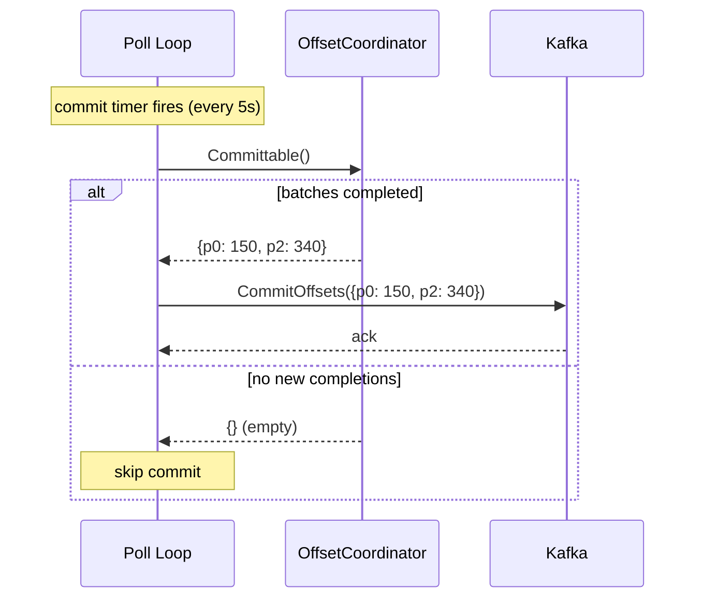

# Scenario: Periodic Offset Commit

> **Requirements:** FR-5.2, FR-6.1, FR-6.2, FR-6.5

## Trigger

The periodic commit timer fires (default: every 5 seconds).

## Preconditions

- Poll loop is running with a commit timer active.
- One or more batches have completed since the last `Committable()` call.
- `enable.auto.commit` is disabled.

## Execution Sequence

1. **Poll loop**: Commit timer fires.
2. **Poll loop**: Calls `OffsetCoordinator.Committable()`.
3. **OffsetCoordinator**: Returns a map of `partition → maxOffset + 1` for all partitions where a batch completed since the last call. Clears the "completed" flag for those partitions.
4. **Poll loop**: If the map is non-empty, calls `CommitOffsets()` to Kafka with the returned offsets.
5. **Kafka**: Acknowledges the commit. The consumer group position advances.

### Variant: No New Completions

If no batches have completed since the last `Committable()` call:

3. **OffsetCoordinator**: Returns an empty map.
4. **Poll loop**: No commit needed. Skips `CommitOffsets()`.

## State Changes

- **OffsetCoordinator**: Completed partitions are cleared after `Committable()` returns them. Dispatched-but-incomplete partitions are unaffected.
- **Kafka**: Consumer group offset advances for committed partitions.

## Outcome

- Completed work is periodically persisted to Kafka.
- Broker load is bounded: at most one commit call per timer interval, regardless of throughput.
- The reprocessing window on crash is bounded by the commit interval.

## Sequence Diagram

