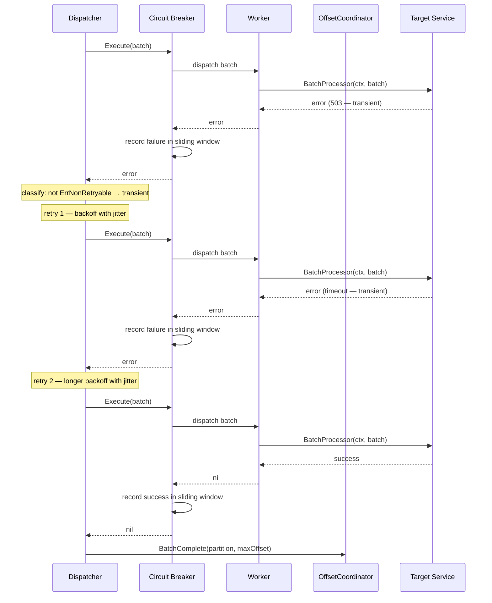

# Scenario: Batch Processing Failure with Retry (Transient Error)

> **Requirements:** FR-3.3, FR-3.4, FR-7.2, NFR-6.1, NFR-6.2, NFR-6.3
> **ADR:** [ADR-0007](../adr/0007-circuit-breaker-for-target-unavailability.md)

## Trigger

A worker's `BatchProcessor` call returns a **transient error** (any error that is NOT a `*ErrNonRetryable`), such as HTTP 503, database timeout, or connection refused.

> **Note:** This scenario covers **transient errors** — operational failures where retrying may succeed. Related scenarios:
> - **Non-retryable errors** (e.g., validation failure, schema mismatch) → [scenario 05](05-retries-exhausted-dlq.md) (immediate DLQ, no retries).
> - **Panics** (programming bugs) → [scenario 11](11-worker-panic.md) (recover → graceful shutdown → pod restart).
> - **Sustained failure** (all workers failing) → [scenario 13](13-target-unavailable.md) (circuit breaker opens).

## Preconditions

- A batch has been dispatched to a worker and `BatchDispatched()` has been called.
- Retry count for this batch is below the configured maximum.
- Target service is experiencing a transient failure.
- Circuit breaker is in **Closed** state (normal operation).

## Execution Sequence

1. **Worker**: Executes `BatchProcessor(ctx, batch)`.
2. **Worker**: Returns an error to the Dispatcher.
3. **Dispatcher**: Classifies the error — not a `*ErrNonRetryable`, so it's **transient**.
4. **Dispatcher**: Reports the failure to the **circuit breaker** (`sony/gobreaker` records it in the sliding window).
5. **Dispatcher**: Increments the retry counter for this batch.
6. **Dispatcher**: Waits for the backoff duration (exponential backoff with jitter).
7. **Dispatcher**: Re-dispatches the same batch to a worker via the circuit breaker.
8. **Worker**: Executes `BatchProcessor(ctx, batch)` again.
9. **Worker**: Returns `nil` (success).
10. **Dispatcher**: Reports the success to the **circuit breaker**.
11. **Dispatcher**: Calls `OffsetCoordinator.BatchComplete(partition, maxOffset)`.

### Variant: Multiple Consecutive Failures

Steps 2–7 repeat for each failed attempt. The backoff duration increases exponentially with jitter on each retry. Each failure is reported to the circuit breaker. If the circuit breaker trips to Open during retries, see [scenario 13](13-target-unavailable.md).

## State Changes

- **OffsetCoordinator**: Remains in `dispatched` state for the partition throughout all retries. `BatchComplete()` is only called on success. No offset is committed for this partition until the batch succeeds.
- **Circuit breaker**: Records each attempt (success/failure) in the sliding window. Remains in Closed state if the overall failure rate stays below the threshold.
- **Partitions**: May become paused if the Dispatcher is at capacity due to the retrying batch occupying a slot.
- **Dispatcher queue**: The batch occupies a worker/slot for the entire retry cycle.

## Outcome

- The batch is eventually processed successfully.
- No messages are lost or skipped.
- The offset is committed only after successful processing.
- Other partitions continue processing independently.
- Circuit breaker failure rate is updated but does not trip (isolated transient failure).

## Sequence Diagram

