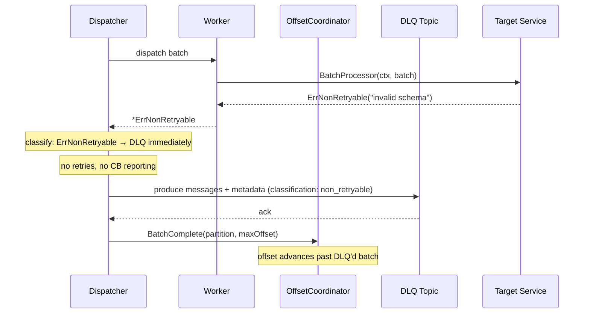
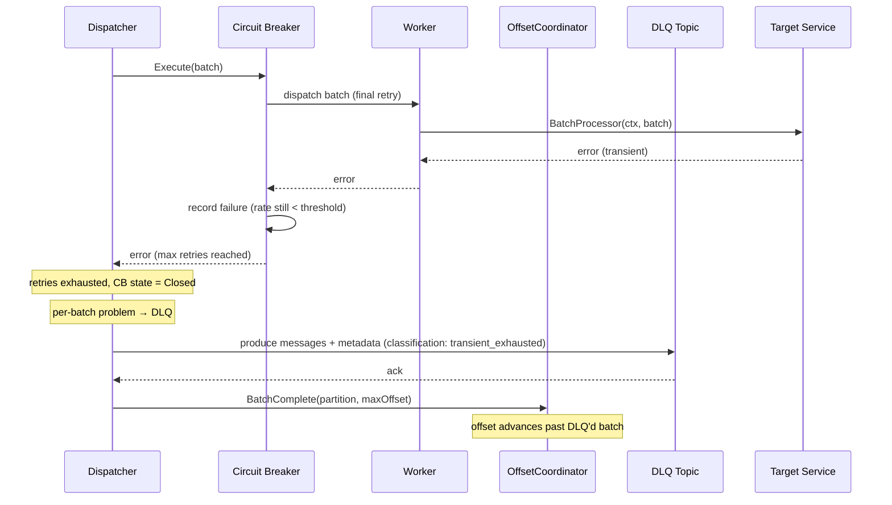

# Scenario: Retries Exhausted / Non-Retryable Error — Dead Letter Queue

> **Requirements:** FR-3.4, FR-4.1, FR-4.2, FR-4.3, FR-7.1, NFR-6.4, NFR-6.5
> **ADR:** [ADR-0007](../adr/0007-circuit-breaker-for-target-unavailability.md)

## Trigger

A batch is routed to the Dead Letter Queue in one of two cases:

- **Case A (Non-retryable error)**: The `BatchProcessor` returns a `*ErrNonRetryable` — the error is classified as non-retryable and will never succeed on retry (e.g., invalid schema, validation failure, authorization error).
- **Case B (Retries exhausted, circuit closed)**: A transient error has exhausted all retries **and** the circuit breaker is still in **Closed** state — indicating this is a per-batch problem, not a system-wide downstream failure.

> **Note:** If retries are exhausted but the circuit breaker is **Open**, the batch is **held** — not sent to the DLQ. See [scenario 13](13-target-unavailable.md).

## Preconditions

- **Case A**: A batch has been dispatched and the `BatchProcessor` returned a `*ErrNonRetryable`.
- **Case B**: A batch has been dispatched, has failed all retry attempts with transient errors, and the circuit breaker remains Closed.
- DLQ topic is configured and the Kafka producer for the DLQ is available.

## Execution Sequence

### Case A: Non-Retryable Error (immediate DLQ)

1. **Worker**: Executes `BatchProcessor(ctx, batch)` — returns `*ErrNonRetryable`.
2. **Dispatcher**: Classifies the error using `errors.As()` — **non-retryable**.
3. **Dispatcher**: Does NOT report to the circuit breaker (non-retryable errors are excluded).
4. **Dispatcher**: Does NOT retry (non-retryable errors skip retries entirely).
5. **Dispatcher**: Produces each message in the failed batch to the DLQ Kafka topic, including metadata:
   - Original message content (key, value, headers).
   - Source topic, partition, and offset.
   - Error reason (the wrapped error message).
   - Error classification: `non_retryable`.
   - Timestamp of the original message and the failure.
6. **Dispatcher**: Waits for DLQ produce acknowledgement.
7. **Dispatcher**: Calls `OffsetCoordinator.BatchComplete(partition, maxOffset)` — the batch is considered "handled" (via DLQ), so the offset can advance.
8. **Poll loop**: On next commit timer tick, commits the offset past the DLQ'd batch.

### Case B: Retries Exhausted with Circuit Closed

1. **Worker**: Executes `BatchProcessor(ctx, batch)` — returns transient error.
2. **Dispatcher**: Classifies as transient. Reports failure to circuit breaker.
3. **Dispatcher**: Retries with exponential backoff (see [scenario 04](04-batch-failure-retry.md)).
4. Steps 1–3 repeat until max retries reached. Circuit breaker remains **Closed** (overall failure rate below threshold — this batch is an outlier).
5. **Dispatcher**: Max retries reached. Circuit is Closed → this is a per-batch problem.
6. **Dispatcher**: Produces each message in the failed batch to the DLQ Kafka topic, including metadata:
   - Original message content (key, value, headers).
   - Source topic, partition, and offset.
   - Error reason (last error message).
   - Error classification: `transient_exhausted`.
   - Retry count and history.
   - Timestamp of the original message and the failure.
7. **Dispatcher**: Waits for DLQ produce acknowledgement.
8. **Dispatcher**: Calls `OffsetCoordinator.BatchComplete(partition, maxOffset)`.
9. **Poll loop**: On next commit timer tick, commits the offset past the DLQ'd batch.

## State Changes

- **OffsetCoordinator**: `dispatched` → `completed`. The offset advances past the failed batch.
- **DLQ topic**: Contains the failed messages with full provenance metadata and error classification.
- **Dispatcher queue**: Slot freed after DLQ production.
- **Circuit breaker**: Case A — unaffected (non-retryable errors excluded). Case B — failure rate recorded but below threshold (isolated failure).

## Outcome

- The consumer advances past the failed batch — it does not block the partition indefinitely.
- Failed messages are preserved in the DLQ for investigation and reprocessing.
- No data loss: messages exist in the DLQ with full context and error classification.
- The partition resumes normal processing for subsequent messages.
- The circuit breaker is not incorrectly tripped by non-retryable errors (bad data ≠ downstream failure).

## Sequence Diagram

### Case A: Non-Retryable Error

### Case B: Retries Exhausted, Circuit Closed

