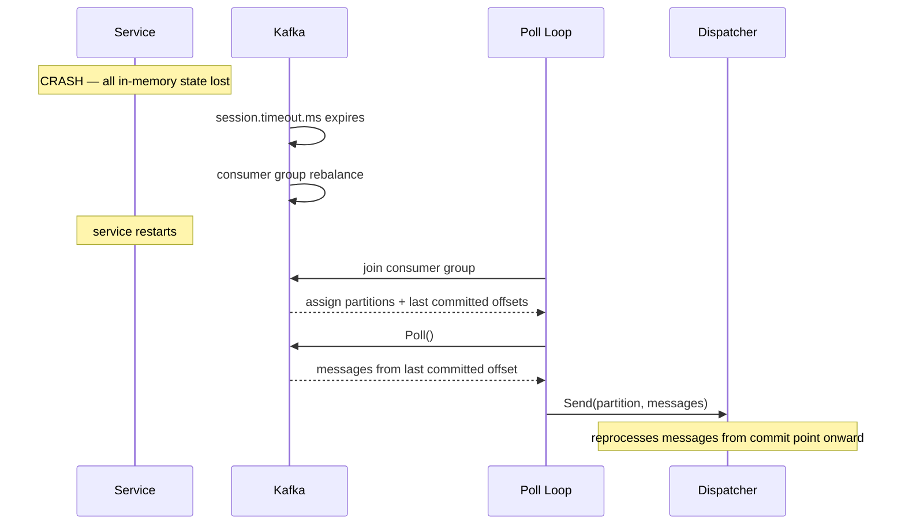

# Scenario: Crash Recovery

> **Requirements:** NFR-2.1, NFR-2.4, FR-6.5

## Trigger

The service process crashes (OOM kill, SIGKILL, panic, hardware failure) — no graceful shutdown occurs.

## Preconditions

- The service was running and processing messages.
- Some batches may have completed but their offsets were not yet committed (within the commit interval window).
- Some batches may have been in-flight (dispatched but not completed).

## Execution Sequence

1. **Process**: Crashes. All in-memory state is lost: Dispatcher queue, OffsetCoordinator state, in-flight batches.
2. **Kafka**: Detects the consumer is gone after `session.timeout.ms` expires. Triggers a consumer group rebalance.
3. **Kafka**: Reassigns the partitions to other consumers in the group (or back to this consumer when it restarts).
4. **Service restarts**: Initializes a new poll loop, Dispatcher, and OffsetCoordinator (empty state).
5. **Poll loop**: Joins the consumer group. Kafka assigns partitions.
6. **Kafka**: Provides the last committed offset for each assigned partition.
7. **Poll loop**: Calls `Poll()`. Kafka delivers messages starting from the last committed offset.
8. **Workers**: Reprocess messages that were completed-but-uncommitted and in-flight-at-crash.

## State Changes

- **OffsetCoordinator**: All state lost → fresh empty state on restart.
- **Kafka consumer group**: Partitions reassigned via rebalance.
- **Kafka offsets**: Unchanged — last committed offsets are the recovery point.

## Outcome

- **No message loss.** Messages from the last committed offset onward are redelivered.
- **Some messages are reprocessed.** The reprocessing window is bounded by the commit interval (default 5s). This is the at-least-once guarantee.
- **Idempotent processing required.** The `BatchProcessor` or target service must handle duplicate messages correctly (NFR-2.2).
- **In-flight batches at crash time are reprocessed from scratch** — any partial writes to the target service must be idempotent.

## Sequence Diagram

