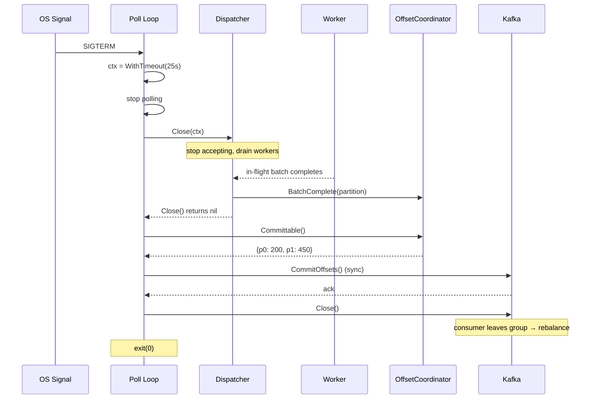
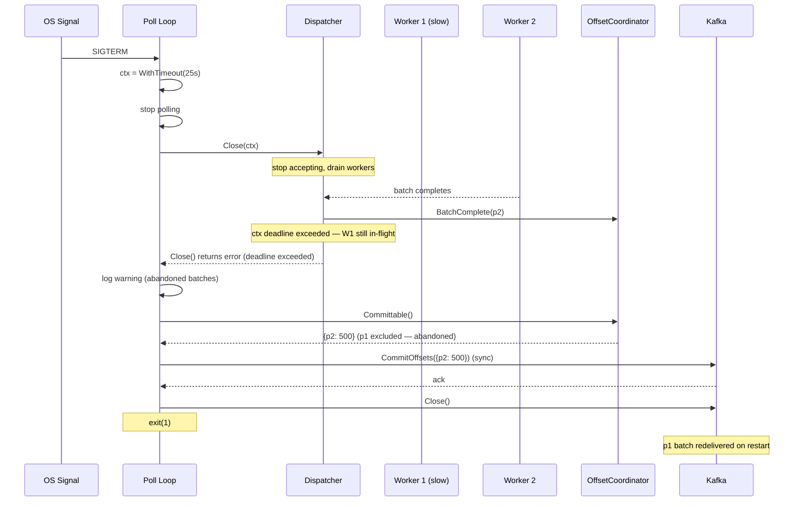

# Scenario: Graceful Shutdown

> **Requirements:** FR-6.3, NFR-2.3, NFR-5.4

## Trigger

The service receives SIGTERM or SIGINT (e.g., Kubernetes pod termination, manual stop).

## Preconditions

- Poll loop is running.
- Some batches may be in-flight (dispatched to workers, not yet completed).
- Some batches may have completed but their offsets are not yet committed (within the commit interval window).
- The service is running in a Kubernetes pod with `terminationGracePeriodSeconds` configured (default 30s).

## Shutdown Deadline

Kubernetes sends SIGKILL after `terminationGracePeriodSeconds` if the process has not exited. The graceful shutdown must complete before this hard deadline.

The poll loop creates a `context.WithTimeout` with a configurable **shutdown timeout** (default: 25s) and passes it to `Dispatcher.Close(ctx)`. This timeout MUST be shorter than `terminationGracePeriodSeconds` to leave a margin for the final offset commit and Kafka consumer close.

```
|<─────────── terminationGracePeriodSeconds (e.g. 30s) ──────────────>|
|<──── shutdown timeout (e.g. 25s) ────>|<── commit + close (≤5s) ──>| SIGKILL
|  SIGTERM                              |                             |
|  drain workers via Close(ctx)         |  Committable()              |
|                                       |  CommitOffsets()            |
|                                       |  Close Kafka consumer       |
```

## Execution Sequence

### Happy Path: Workers Drain Within Deadline

1. **Poll loop**: Catches SIGTERM/SIGINT via signal handler.
2. **Poll loop**: Creates a shutdown context: `ctx, cancel := context.WithTimeout(context.Background(), shutdownTimeout)`.
3. **Poll loop**: Stops fetching new messages — no more `Dispatcher.Send()` calls.
4. **Poll loop**: Calls `Dispatcher.Close(ctx)`.
5. **Dispatcher**: Stops accepting new batches.
6. **Dispatcher**: Waits for all in-flight workers to complete their current batches. Workers call `OffsetCoordinator.BatchComplete()` as they finish.
7. **Dispatcher**: All workers done. Returns `nil` from `Close()`.
8. **Poll loop**: Calls `OffsetCoordinator.Committable()` to collect all completed offsets.
9. **Poll loop**: Calls `CommitOffsets()` **synchronously** to Kafka — waits for broker acknowledgement.
10. **Poll loop**: Closes the Kafka consumer.
11. **Process**: Exits cleanly with exit code 0.

### Timeout Path: Deadline Exceeded

1–4. Same as above.
5. **Dispatcher**: Stops accepting new batches.
6. **Dispatcher**: Waits for in-flight workers, but the shutdown context expires before all workers complete.
7. **Dispatcher**: Returns an error from `Close(ctx)` (context deadline exceeded). Remaining in-flight batches are abandoned — their offsets will not be committed.
8. **Poll loop**: Logs a warning with details of the abandoned batches.
9. **Poll loop**: Calls `OffsetCoordinator.Committable()` — returns offsets only for batches that completed before the deadline.
10. **Poll loop**: Calls `CommitOffsets()` synchronously for the completed offsets.
11. **Poll loop**: Closes the Kafka consumer.
12. **Process**: Exits with non-zero exit code.
13. **On restart**: Kafka redelivers the abandoned batches from their uncommitted offsets.

## State Changes

### Happy Path
- **Dispatcher**: Running → draining → closed.
- **OffsetCoordinator**: All completed batches reported via `Committable()` and committed. State discarded.
- **Kafka**: Consumer group offsets up-to-date. Partition reassignment on consumer leave.

### Timeout Path
- **Dispatcher**: Running → draining → **timed out** (some workers still in-flight).
- **OffsetCoordinator**: Only batches completed before the deadline are committable. Abandoned batches remain in `dispatched` state — never committed.
- **Kafka**: Offsets committed for completed batches only. Abandoned batches will be redelivered on restart.

## Outcome

- **Within deadline**: All in-flight batches complete, all offsets committed, zero reprocessing on restart. Clean consumer group leave triggers immediate rebalance.
- **Deadline exceeded**: Completed work is committed (minimizes reprocessing). Abandoned batches are redelivered on restart — at-least-once guarantee preserved. The process exits before SIGKILL.
- **No hang risk**: The shutdown context guarantees the drain phase is bounded. Even if workers are stuck or slow, the process exits within the deadline.

## Configuration

| Parameter | Default | Constraint |
|-----------|---------|------------|
| `shutdown_timeout` | 25s | MUST be less than Kubernetes `terminationGracePeriodSeconds` |
| `terminationGracePeriodSeconds` (K8s) | 30s | Set in pod spec |

The margin between them (e.g., 5s) must be sufficient for `Committable()` + `CommitOffsets()` + Kafka consumer close.

## Sequence Diagram

### Happy Path



### Timeout Path


