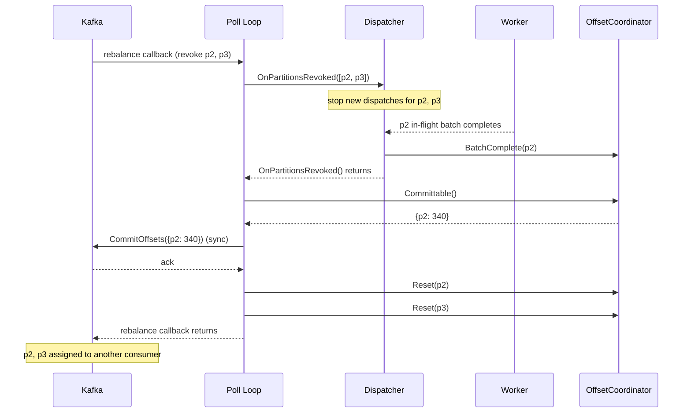

# Scenario: Consumer Group Rebalance — Partition Revocation

> **Requirements:** FR-1.4, FR-1.8, FR-2.7, FR-5.3, FR-6.4

## Trigger

Kafka initiates a consumer group rebalance and revokes one or more partitions from this consumer. Common causes: a new consumer joins the group, a consumer leaves or crashes, partition count changes.

## Preconditions

- Poll loop is running with assigned partitions.
- Some revoked partitions may have in-flight batches.
- Some revoked partitions may have completed-but-uncommitted offsets.
- Using `CooperativeStickyAssignor` — only the affected partitions are revoked, not all partitions.

## Execution Sequence

1. **Kafka**: Triggers rebalance. The rebalance callback fires during a `Poll()` call.
2. **Poll loop**: Receives the revocation callback with the list of revoked partitions.
3. **Poll loop**: Calls `Dispatcher.OnPartitionsRevoked(revokedPartitions)`.
4. **Dispatcher**: Stops dispatching new batches for the revoked partitions.
5. **Dispatcher**: Waits for in-flight workers processing batches from revoked partitions to complete. Workers call `OffsetCoordinator.BatchComplete()` as they finish.
6. **Dispatcher**: Returns from `OnPartitionsRevoked()`.
7. **Poll loop**: Calls `OffsetCoordinator.Committable()` to collect completed offsets for the revoked partitions.
8. **Poll loop**: Calls `CommitOffsets()` **synchronously** to Kafka for the revoked partitions only.
9. **Poll loop**: Calls `OffsetCoordinator.Reset(partition)` for each revoked partition — clears stale state.
10. **Poll loop**: Returns from the rebalance callback. Kafka assigns the revoked partitions to another consumer.

**Important:** Non-revoked partitions continue processing normally throughout this sequence (cooperative rebalance).

## State Changes

- **Dispatcher**: Revoked partition state (channels, workers if partition-specific) is torn down.
- **OffsetCoordinator**: Revoked partitions are committed then reset. Non-revoked partitions are unaffected.
- **Kafka**: Revoked partition offsets are committed. Partitions move to another consumer.

## Outcome

- No message loss on revoked partitions — in-flight batches are drained and offsets committed before handoff.
- No stale state — OffsetCoordinator is reset for revoked partitions.
- Non-revoked partitions experience no disruption (cooperative sticky assignment).
- The new owner of the revoked partitions starts from the committed offset.

## Sequence Diagram

