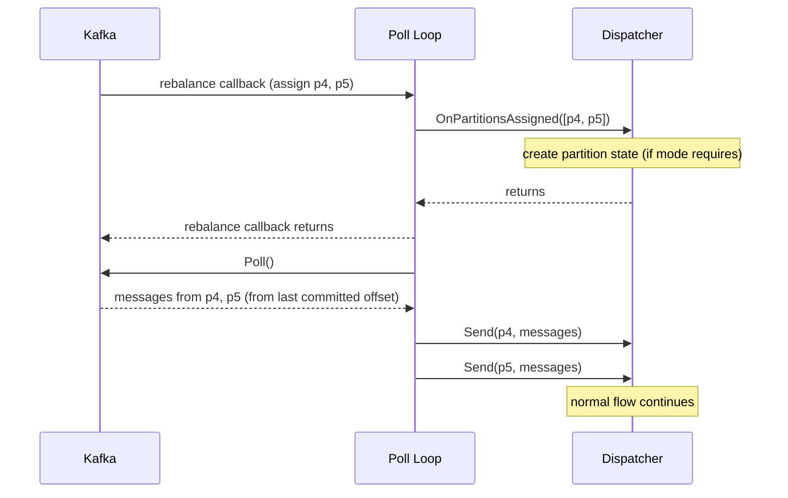

# Scenario: Consumer Group Rebalance — Partition Assignment

> **Requirements:** FR-1.4, FR-1.8, FR-2.7

## Trigger

Kafka assigns new partitions to this consumer during a rebalance. This happens when: the consumer first joins the group, another consumer leaves or crashes, or partitions are redistributed.

## Preconditions

- Poll loop is running.
- Using `CooperativeStickyAssignor` — existing partition assignments are retained; only new partitions are added.

## Execution Sequence

1. **Kafka**: Triggers rebalance. The assignment callback fires during a `Poll()` call.
2. **Poll loop**: Receives the assignment callback with the list of newly assigned partitions.
3. **Poll loop**: Calls `Dispatcher.OnPartitionsAssigned(newPartitions)`.
4. **Dispatcher**: Creates partition-specific internal state if needed (relevant for PartitionDispatcher — channels and workers per partition). For UnorderedDispatcher, this is a no-op since all partitions share the same channel and worker pool.
5. **Dispatcher**: Returns from `OnPartitionsAssigned()`.
6. **Poll loop**: Returns from the rebalance callback. The newly assigned partitions are in resumed state.
7. **Poll loop**: Next `Poll()` returns messages from the new partitions (starting from the last committed offset for each).
8. **Poll loop**: Normal flow continues — `Send()` to Dispatcher, batch assembly, worker dispatch.

## State Changes

- **Dispatcher**: New partition state created (if mode requires it). Existing partition state unchanged.
- **OffsetCoordinator**: No change — new partitions start with no tracked state, which is correct (first `BatchDispatched()` will initialize them).
- **Kafka**: New partitions are now owned by this consumer.

## Outcome

- New partitions begin processing seamlessly.
- Existing partitions experience no disruption (cooperative sticky assignment).
- Messages are consumed from the last committed offset for each new partition — no messages skipped, at-least-once guarantee preserved.

## Sequence Diagram

