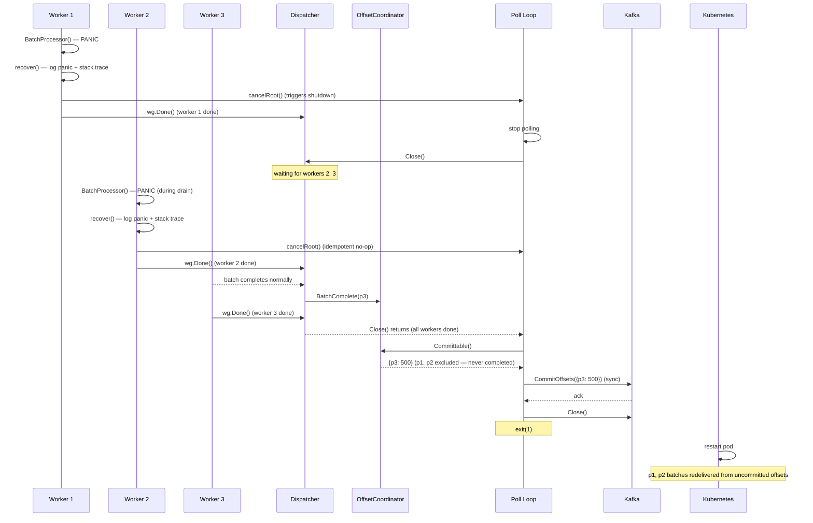

# Scenario: Worker Panic

> **Requirements:** FR-3.1, FR-3.3, FR-3.6, NFR-2.3
> **ADR:** [ADR-0005](../adr/0005-panic-recovery-with-graceful-shutdown.md)

## Trigger

A worker goroutine panics during `BatchProcessor` execution (e.g., nil pointer dereference, index out of bounds, type assertion failure).

## Preconditions

- A batch has been dispatched to a worker and `BatchDispatched()` has been called.
- Other workers may be processing batches for other partitions concurrently.
- The service is running in a Kubernetes pod with `restartPolicy: Always`.

## Execution Sequence

1. **Worker**: Executes `BatchProcessor(ctx, batch)` — a panic occurs.
2. **Worker**: The deferred `recover()` catches the panic.
3. **Worker**: Logs a structured error entry containing:
   - Panic value and full stack trace (`debug.Stack()`).
   - Partition, batch offset range, worker identity.
4. **Worker**: Calls `cancelRoot()` — cancels the root `context.Context`.
5. **Poll loop**: Detects context cancellation. Initiates graceful shutdown ([scenario 07](07-graceful-shutdown.md)):
   - Stops polling new messages.
   - Creates a shutdown context with timeout: `ctx = context.WithTimeout(shutdownTimeout)`.
   - Calls `Dispatcher.Close(ctx)`.
6. **Dispatcher**: Waits for other in-flight workers to complete their current batches, bounded by the shutdown timeout. Workers report `BatchComplete()` as they finish. If the deadline is exceeded, `Close()` returns with an error and remaining workers are abandoned (see [scenario 07 timeout path](07-graceful-shutdown.md)).
7. **Dispatcher**: Returns from `Close()`.
8. **Poll loop**: Calls `OffsetCoordinator.Committable()` — returns offsets for all completed batches. The panicking batch is **not included** (it was never completed).
9. **Poll loop**: Calls `CommitOffsets()` synchronously to Kafka.
10. **Poll loop**: Closes the Kafka consumer. Process exits with non-zero exit code.
11. **Kubernetes**: Detects the pod exited. Restarts it per `restartPolicy`.
12. **Service restarts**: Joins the consumer group. Kafka assigns partitions. The panicking batch is redelivered from its uncommitted offset.

### Variant: Cascading Panics During Drain

Other workers may also panic while `Dispatcher.Close()` is draining in-flight work:

6. **Worker 2**: Panics while processing its batch during the drain phase.
7. **Worker 2**: `recover()` catches the panic. Logs the panic with full diagnostics.
8. **Worker 2**: Calls `cancelRoot()` — idempotent, no effect (shutdown already in progress).
9. **Worker 2**: `defer d.wg.Done()` fires — signals the worker is done. `Close()` does not hang.
10. **Dispatcher**: Continues waiting for remaining workers. All panics are recovered independently.

**Implementation detail:** Each worker's `defer` stack must signal completion (`wg.Done()`) even on panic. The `defer` ordering matters — `wg.Done()` is deferred first (executes last, LIFO), so `recover()` runs before the WaitGroup is decremented. This ensures the panic is fully handled before `Close()` sees the worker as done.

### Variant: Deterministic Panic (Same Input = Same Panic)

If the panic is caused by a specific message:

12. **Service restarts**: Receives the same batch → panics again → graceful shutdown → exit.
13. **Kubernetes**: Applies exponential backoff (10s → 20s → 40s → ... → 5min cap).
14. **Kubernetes**: Enters `CrashLoopBackOff` state — visible in monitoring, triggers alerts.
15. **Engineers**: Investigate logs (panic value + stack trace), deploy a fix.

## State Changes

- **OffsetCoordinator**: Panicking batch remains in `dispatched` state — never transitions to `completed`. Other partitions' completed batches are committed normally.
- **Dispatcher**: Drains in-flight work for non-panicking workers, then shuts down.
- **Kafka offsets**: Advanced for all completed batches except the panicking one. On restart, consumption resumes from the panicking batch's offset.

## Outcome

- **No data loss.** The panicking batch is redelivered on restart.
- **No silent failure.** The panic is logged with full diagnostics. Persistent panics trigger CrashLoopBackOff and alerts.
- **Minimal collateral damage.** Other in-flight batches are drained and their offsets committed before shutdown.
- **No false DLQ entries.** The message isn't poison — the code has a bug. DLQ'ing would mask the issue.
- **Clean recovery.** The reprocessing window includes only the panicking batch and any batches dispatched-but-not-completed at shutdown time.

## Sequence Diagram

