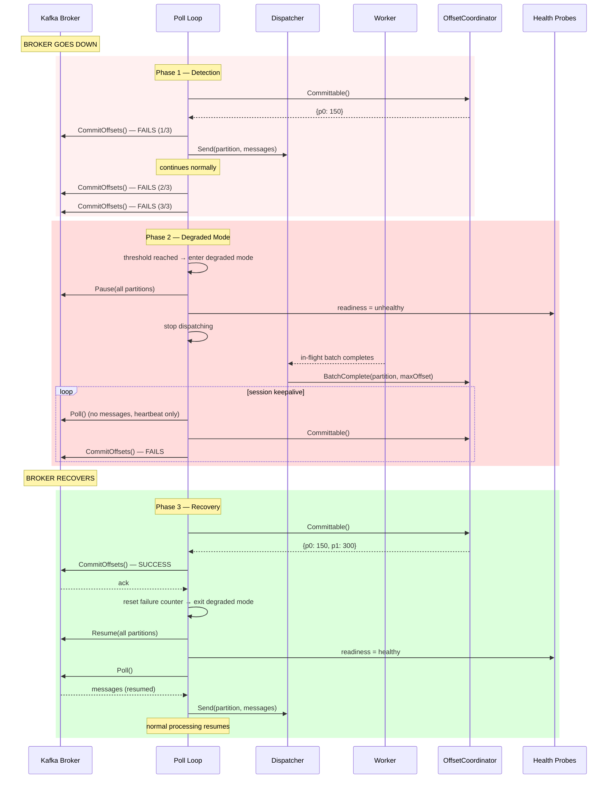

# Scenario: Kafka Broker Unavailable

> **Requirements:** FR-1.6, FR-1.9, FR-1.10, NFR-3.3, NFR-5.5
> **ADR:** [ADR-0006](../adr/0006-broker-unavailability-handling.md), [ADR-0007](../adr/0007-circuit-breaker-for-target-unavailability.md) (unified degraded mode)

## Trigger

The Kafka broker becomes unreachable (network partition, broker crash, cluster maintenance). `CommitOffsets()` starts failing.

## Preconditions

- Poll loop is running and processing messages normally.
- Some batches may be in-flight.
- The commit timer fires periodically (default: every 5s).
- Consecutive commit failure counter is at zero.

## Execution Sequence

### Phase 1: Detection (transient failures tolerated)

1. **Poll loop**: Commit timer fires. Calls `OffsetCoordinator.Committable()`.
2. **Poll loop**: Calls `CommitOffsets()` — **fails** (broker unreachable).
3. **Poll loop**: Increments consecutive failure counter to 1. Logs a warning.
4. **Poll loop**: Continues polling and dispatching normally. Workers continue processing.
5. Steps 1–4 repeat on subsequent timer ticks. Counter increments to 2, then 3.

### Phase 2: Degraded Mode (threshold reached)

6. **Poll loop**: Consecutive failure counter reaches the configured threshold (default: 3).
7. **Poll loop**: Enters **degraded mode** (sets `BrokerUnavailable` reason):
   - Stops calling `Dispatcher.Send()` — no new batches dispatched.
   - Calls `Pause()` on all assigned partitions.
   - Sets the readiness probe to unhealthy.
   - Logs an error: "entering degraded mode — broker unavailable, commit failures exceeded threshold."
8. **Workers**: Complete their current in-flight batches. Dispatcher calls `OffsetCoordinator.BatchComplete()` for each.
9. **Poll loop**: Continues calling `Poll()` at regular intervals — maintains consumer group session (heartbeats, rebalance callbacks). Returns no messages from paused partitions.
10. **Poll loop**: Commit timer continues firing. Each tick calls `Committable()` and attempts `CommitOffsets()`. Fails while broker is down.

### Phase 3: Recovery (broker returns)

11. **Broker**: Becomes reachable again. librdkafka auto-reconnects (exponential backoff with jitter, handled internally).
12. **Poll loop**: Commit timer fires. Calls `CommitOffsets()` — **succeeds**.
13. **Poll loop**: All accumulated completed offsets are committed to Kafka.
14. **Poll loop**: Resets consecutive failure counter to zero.
15. **Poll loop**: Clears `BrokerUnavailable` degraded reason. If no other degraded reasons are active (e.g., `TargetUnavailable` from the circuit breaker), exits degraded mode:
    - Calls `Resume()` on all assigned partitions.
    - Sets the readiness probe to healthy.
    - Resumes calling `Dispatcher.Send()`.
    - Logs: "exiting degraded mode — broker connection restored."
    If `TargetUnavailable` is still active, the service remains in degraded mode. See [scenario 13](13-target-unavailable.md).
16. **Poll loop**: Next `Poll()` returns messages from resumed partitions. Normal processing resumes.

## State Changes

### Detection Phase (steps 1–5)
- **Commit failure counter**: 0 → 1 → 2 (below threshold).
- **Processing**: Continues normally. New batches dispatched.
- **OffsetCoordinator**: Completed batches accumulate — offsets are committable but commits fail.

### Degraded Mode (steps 6–10)
- **Commit failure counter**: Reaches threshold (3).
- **Partitions**: All **paused**.
- **Dispatcher**: No new batches. In-flight workers drain.
- **Readiness probe**: **Unhealthy**.
- **Liveness probe**: Healthy (poll loop is alive).
- **OffsetCoordinator**: Holds completed offsets, waiting for successful commit.

### Recovery (steps 11–16)
- **Commit failure counter**: Reset to 0.
- **Partitions**: All **resumed**.
- **Readiness probe**: **Healthy**.
- **OffsetCoordinator**: Cleared — accumulated offsets committed successfully.

## Outcome

- **No message loss.** Paused partitions retain messages in Kafka. Uncommitted offsets are committed on recovery.
- **Bounded reprocessing window.** Only batches in-flight when degraded mode started are at risk of reprocessing on crash — not the entire outage duration.
- **Consumer group session preserved.** `Poll()` continues throughout the outage, maintaining heartbeats. No unnecessary rebalances.
- **Self-healing.** The service automatically resumes processing when the broker returns. No manual intervention.
- **Visible degradation.** Readiness probe failure surfaces the issue in Kubernetes dashboards and alerting.

## Configuration

| Parameter | Default | Description |
|-----------|---------|-------------|
| `commit_failure_threshold` | 3 | Consecutive `CommitOffsets()` failures before degraded mode |
| `commit_interval` | 5s | Time between commit attempts |
| Detection time | ~15s | `threshold × interval` (3 × 5s) |

## Sequence Diagram

