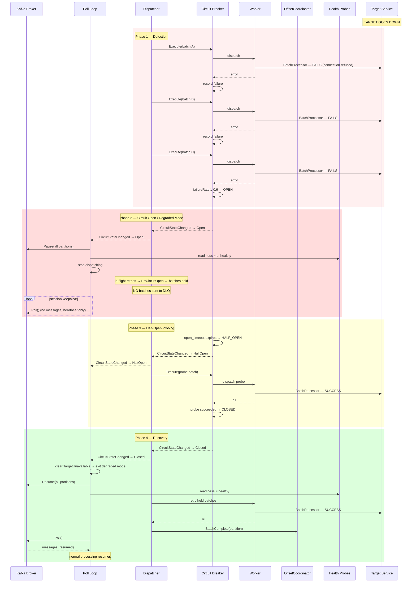

# Scenario: Target Service Unavailable (Circuit Breaker)

> **Requirements:** FR-1.11, FR-2.10, FR-3.4, FR-4.1, FR-7.2, NFR-5.6, NFR-6.2, NFR-6.5
> **ADR:** [ADR-0007](../adr/0007-circuit-breaker-for-target-unavailability.md), [ADR-0006](../adr/0006-broker-unavailability-handling.md) (unified degraded mode)

## Trigger

The target service (database, API, downstream microservice) becomes unavailable. Multiple workers fail with transient errors. The circuit breaker's failure rate exceeds the configured threshold.

## Preconditions

- Poll loop is running and processing messages normally.
- Multiple batches are being dispatched to workers.
- Circuit breaker is in **Closed** state (normal operation).
- Target service goes down (network partition, crash, overload).

## Execution Sequence

### Phase 1: Detection (failure rate rising)

1. **Worker A**: `BatchProcessor(ctx, batch)` → transient error (connection refused).
2. **Dispatcher**: Classifies as transient. Reports failure to circuit breaker. Starts retry with backoff.
3. **Worker B**: `BatchProcessor(ctx, batch)` → transient error (connection refused).
4. **Dispatcher**: Reports failure to circuit breaker. Starts retry with backoff.
5. **Worker C**: `BatchProcessor(ctx, batch)` → transient error (connection refused).
6. **Dispatcher**: Reports failure to circuit breaker.
7. **Circuit breaker**: Evaluates — `requests >= min_requests (3) AND failureRate (1.0) >= threshold (0.6)`.

### Phase 2: Circuit Opens → Degraded Mode

8. **Circuit breaker**: Transitions to **Open** state.
9. **Dispatcher**: Emits `CircuitOpen` on the `CircuitStateChanged()` channel.
10. **Poll loop**: Receives `CircuitOpen`. Enters **degraded mode** (sets `TargetUnavailable` reason):
    - Stops calling `Dispatcher.Send()` — no new batches dispatched.
    - Calls `Pause()` on all assigned partitions.
    - Sets the readiness probe to unhealthy.
    - Logs: "entering degraded mode — target service unavailable, circuit breaker open."
11. **In-flight retries**: Workers A, B, C are still retrying with backoff. Each retry attempt goes through the circuit breaker:
    - If the circuit is already Open, the attempt returns `ErrCircuitOpen` immediately — no actual call to the target. The batch is **held** (not DLQ'd).
    - Held batches remain in the Dispatcher, waiting for the circuit to enter Half-Open.
12. **Poll loop**: Continues calling `Poll()` at regular intervals — maintains consumer group session. Returns no messages from paused partitions.
13. **Poll loop**: Commit timer continues firing. Commits any previously completed offsets (batches that succeeded before the circuit opened).

### Phase 3: Half-Open Probing

14. **Circuit breaker**: After `open_timeout` (default: 30s), transitions to **Half-Open** state.
15. **Dispatcher**: Emits `CircuitHalfOpen` on the `CircuitStateChanged()` channel.
16. **Poll loop**: Receives `CircuitHalfOpen`. Resumes limited dispatch for probing:
    - Resumes partitions (limited — only enough for probe batches).
    - Allows `max_requests` (default: 1) batches to be dispatched.
17. **Dispatcher**: Dispatches one held batch (or a new batch) to a worker as a probe.
18. **Worker**: `BatchProcessor(ctx, batch)` → attempts to reach the target service.

#### Variant A: Probe succeeds

19a. **Worker**: Returns `nil` (success).
20a. **Dispatcher**: Reports success to circuit breaker.
21a. **Circuit breaker**: All `max_requests` probes succeeded → transitions to **Closed** state.
22a. **Dispatcher**: Emits `CircuitClosed` on the `CircuitStateChanged()` channel.
23a. **Poll loop**: Receives `CircuitClosed`. Clears `TargetUnavailable` reason. If no other degraded reasons active, exits degraded mode:
     - Calls `Resume()` on all assigned partitions.
     - Sets the readiness probe to healthy.
     - Resumes full dispatch.
     - Logs: "exiting degraded mode — target service recovered, circuit breaker closed."
24a. **Dispatcher**: Retries all held batches. Normal processing resumes.

#### Variant B: Probe fails

19b. **Worker**: Returns transient error.
20b. **Dispatcher**: Reports failure to circuit breaker.
21b. **Circuit breaker**: Transitions back to **Open** state (with increased backoff for `open_timeout`).
22b. **Dispatcher**: Emits `CircuitOpen` on the `CircuitStateChanged()` channel.
23b. **Poll loop**: Remains in degraded mode. Pauses partitions again.
24b. Waits for next `open_timeout` expiry → returns to step 14.

## State Changes

### Detection Phase (steps 1–7)
- **Circuit breaker**: Closed. Failure rate rising as workers report transient errors.
- **Processing**: Workers are retrying individually. New batches still being dispatched.
- **Partitions**: Resumed (normal operation).

### Circuit Open / Degraded Mode (steps 8–13)
- **Circuit breaker**: **Open**.
- **Degraded reason**: `TargetUnavailable` set.
- **Partitions**: All **paused**.
- **Dispatcher**: No new batches. In-flight retries return `ErrCircuitOpen` — batches held.
- **Readiness probe**: **Unhealthy**.
- **Liveness probe**: Healthy (poll loop is alive).
- **DLQ**: No batches sent — held batches are not DLQ'd while circuit is Open.

### Half-Open Probing (steps 14–18)
- **Circuit breaker**: **Half-Open**.
- **Partitions**: Limited resume for probe batch(es).
- **Dispatcher**: Limited dispatch (`max_requests` probes).

### Recovery (variant A, steps 19a–24a)
- **Circuit breaker**: **Closed**.
- **Degraded reason**: `TargetUnavailable` cleared.
- **Partitions**: All **resumed** (if no other degraded reasons active).
- **Readiness probe**: **Healthy** (if no other degraded reasons active).
- **Held batches**: Retried and processed normally.

## Outcome

- **No DLQ flooding.** Batches are held while the circuit is Open — not sent to the DLQ. Valid messages are preserved in Kafka.
- **Bounded reprocessing window.** Only batches in-flight when the circuit opened are at risk on crash — not the entire outage.
- **Self-healing.** Half-open probing automatically detects recovery. No manual intervention.
- **Consumer group session preserved.** `Poll()` continues throughout, maintaining heartbeats.
- **Visible degradation.** Readiness probe fails → Kubernetes dashboards and alerting detect the issue.
- **Unified with broker unavailability.** Both scenarios use the same degraded mode infrastructure. If both occur simultaneously, the service remains degraded until both are resolved.

## Configuration

| Parameter | Default | Description |
|-----------|---------|-------------|
| `cb_min_requests` | 3 | Minimum requests before failure rate is evaluated |
| `cb_failure_threshold` | 0.6 | Failure rate that triggers Open state |
| `cb_open_timeout` | 30s | Wait time before transitioning to Half-Open |
| `cb_max_requests` | 1 | Probe requests allowed in Half-Open state |
| `cb_interval` | 60s | Sliding window interval for failure rate |

## Sequence Diagram

